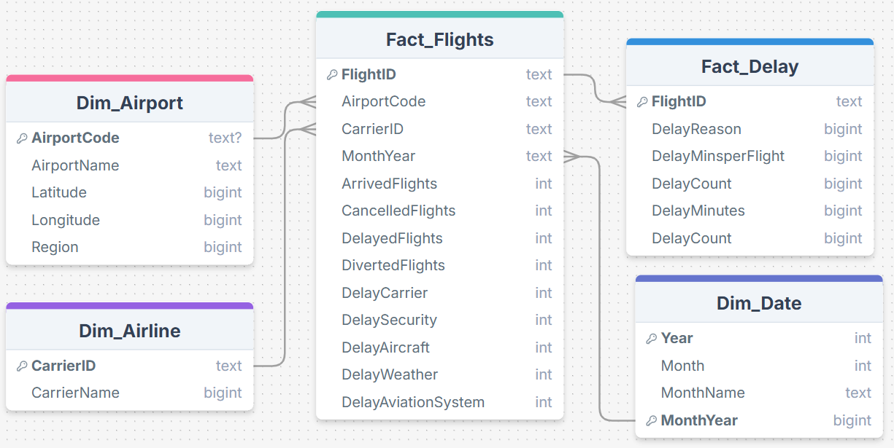
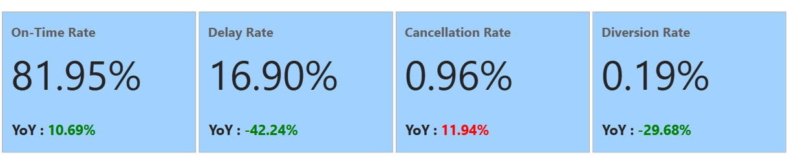
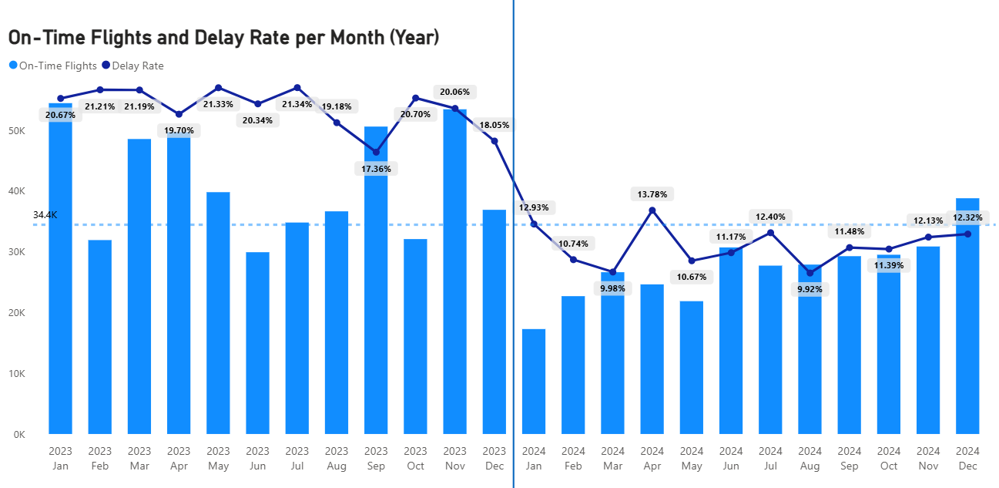
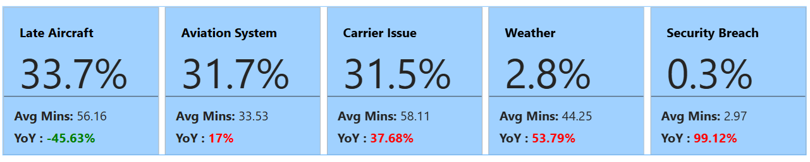
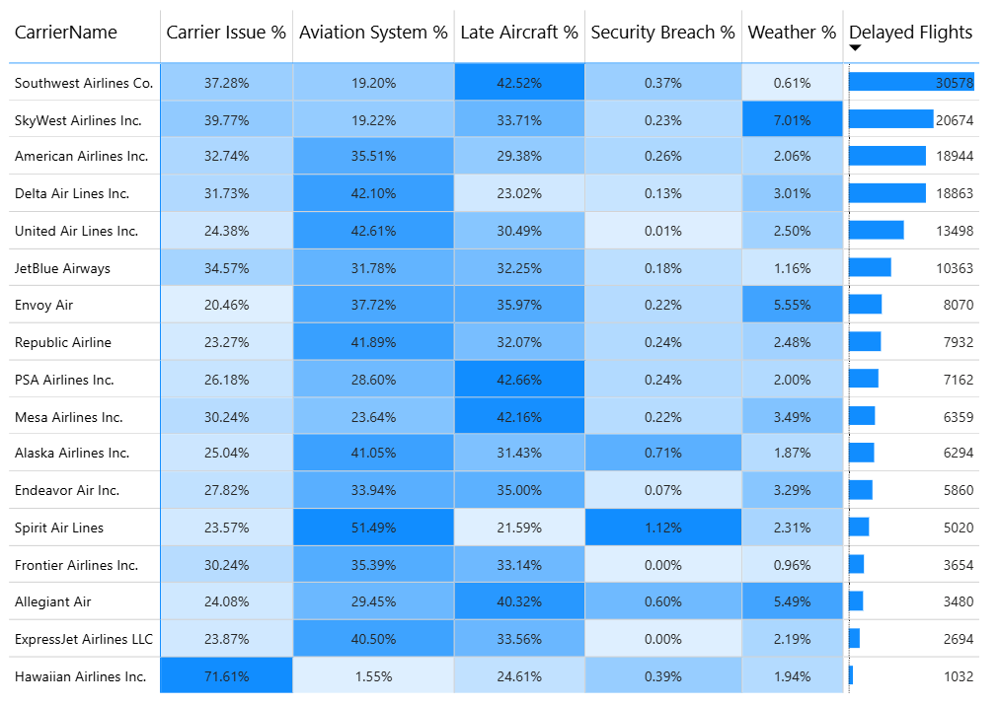
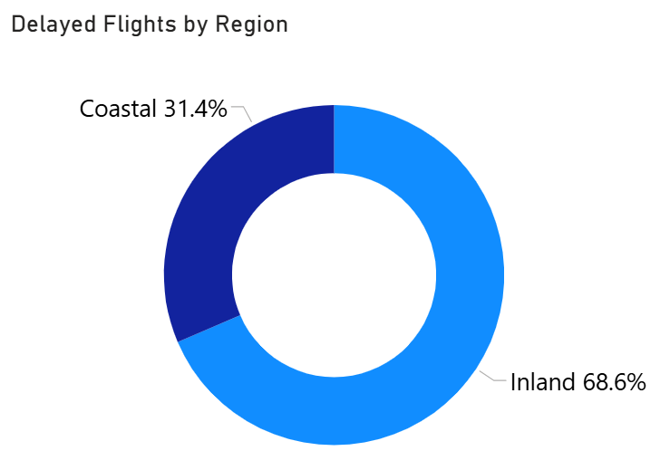

# Airlines-Peformance-and-Delay-Analysis

Air travel is an essential component of global mobility, connecting people, businesses, and economies. However, *flight delays remain a persistent challenge* in the aviation industry, affecting millions of passengers each year and *causing substantial financial and operational setbacks* for airlines. Delays not only inconvenience travelers but also ripple across airline schedules, airport operations, and supply chains, highlighting the need for a data-driven understanding of their causes and patterns.

Analyzing flight data provides **critical insights into operational inefficiencies, and external factors that affects/cause flight delay**. This project leverages real-world flight data to explore delay patterns, offering actionable insights that can help airlines optimize schedules, enhance customer experience, and improve overall on-time performance.

## Project Objective
The project aims to analyze airline performance and flight delays to identify trends, causes, and opportunities for improving punctuality and operational efficiency.

#### Some Key Questions to guide analysis include:
1. Which months and airports experience the highest flight traffic?  
2. During which periods are flight delays most frequent, and how do they vary across airlines?  
3. What are the primary reasons for flight delays (carrier, weather, late aircraft, etc.)?  
4. Which airports or regions are most affected by delays, particularly due to weather, and are there coastal vs. inland patterns?  
5. What percentage of flights experience delays over 15 minutes, and which airlines or airports have the best on-time performance?

## Data Structure
The data was collected, cleaned, formatted and transformed from flat table to analytical table

## Analysis Insights

### Overall Metrics

Across January 2023 to December 2024, a total of **1 million flights** were recorded. Overall performance shows that **81.95% of flights arrived on time**, while **16.9% were delayed, 0.96% were cancelled**, and **0.19% were diverted**.

Year-over-year, on-time performance improved significantly by **+10.69%** (2024 vs. 2023). Delay rates saw a substantial **−42.24% reduction**, alongside a **−29.68% drop** in diversions. However, cancellations increased by **+11.94%**, representing the only negative shift in operational performance.

The chart shows a clear improvement in flight punctuality from 2023 to 2024. In 2023, delay rates consistently hovered around the **19–21%** range, with on-time flight volumes fluctuating but majority months generally staying above the annual average. However, beginning in early 2024, delay rates dropped sharply into the **10–13%** range, signalling a major operational shift. This reduction aligns with the YoY improvement of **+10.69%** in on-time performance and the significant **−42.24%** drop in delays highlighted earlier. 

Although 2024 had lower flight volume than 2023 , it steadily increased toward the end of the year, reinforcing the trend of operational recovery. This monthly pattern supports the broader insight that 2024 experienced stronger punctuality performance despite some flight volume fluctuations, leading to better overall flight reliability compared to 2023.

### Causes of Flight Delay 

The breakdown of delay causes highlights **Late Aircraft and Aviation System issues** as the dominant contributors, accounting for **33.7% and 31.7%** of delays respectively. Notably, **Late Aircraft delays** show a significant **−45.63% YoY reduction**, indicating major improvements in aircraft turnaround efficiency and scheduling coordination. In contrast, **Aviation System delay increased by 17% YoY**, suggesting rising congestion, air traffic management constraints, or infrastructure-related challenges.

**Carrier Issues**, responsible for **31.5% of delays**, also increased substantially **(+37.68% YoY)**, signalling operational bottlenecks within airline processes such as crew scheduling, baggage handling, or maintenance-related disruptions. **Weather-related delays** remain low at **2.8%,** but the **53.79% YoY increase** suggests a growing impact from adverse or unpredictable weather patterns. Finally, **Security Breach delays**, though only **0.3%** of total delays, nearly doubled year-over-year **(+99.12%)**, indicating heightened security interventions or policy changes affecting flight operations.

Each delay causes: Aviation Syaytem, Carrier Issue, Weather and Security Breach can be seen to mostly consistenly worsen across each month in 2024 compared to 2023.

Overall, while improvements in Late Aircraft delays demonstrate progress in operational efficiency, rising delays across system, carrier, weather, and security factors point to systemic and environmental pressures that require broader mitigation strategies.

### Delay distribution per Airline 

The table shows that delay causes vary significantly by airline. **Southwest, SkyWest, and American Airlines record the highest number of delayed flights**, driven mainly by **Late Aircraft and Carrier issues**. Major network carriers such as **Delta and United** experience a large share of delays from **Aviation System factors (over 40%)**, reflecting their operations in congested hubs. 

In contrast, airlines like **Hawaiian Airlines** stand out with **unusually high Carrier Issue delays (71.6%)**, indicating internal operational challenges. Weather-related delays remain relatively low across most carriers, except **SkyWest and Envoy**, where weather contributes more noticeably. 

Overall, system-related and late-aircraft issues dominate delay causes, but each carrier’s operational environment shapes its unique delay profile.

<table>
  <tr>
    <td>
      
    </td>
    <td style="vertical-align: top; padding-left: 50px;">
      

        It is also important to note that most delays <strong>(68.6%)</strong> 
        were experienced at airports located in the Inland Regions. Indicating that
        airports in this reqion face higher operational or environmental challenges.
      

    </td>
  </tr>
</table>

## Report View

**For further exploration, Check out the [power bi dashboard](https://app.powerbi.com/view?r=eyJrIjoiY2MzODEwYjktM2M0Ni00MWRhLTg1ZWItYjk3Zjc0NjJlNTRhIiwidCI6IjczMDc4ZWNkLWYzM2UtNDQxYy05ODYyLWVhZDdjNjFhNGU4MiJ9)**

## Recommendations
To ensure better operational efficiency for airlines:
1. **Weather and Security Breach:**
Although weather-related delays and security breaches account for a smaller proportion of total delays, their **very high year-over-year growth** highlights the need for proactive management. Incorporating advanced weather forecasting can help mitigate weather-related disruptions in advance.
While security breaches typically **last less than 3 minutes**, even this brief window can have **significant operational and reputational impacts**. Automated security monitoring and continuous oversight should be enhanced to prevent such incidents.

2. **Late Aircraft, Aviation System, and Carrier Issues:** 
Together, these three factors contribute to **97% of airline delays**. While late aircraft delays have been significantly reduced, aviation system failures and carrier issues remain major concerns. To address carrier issues, strategies such as predictive maintenance, improved crew scheduling, and optimized workforce management should be implemented.
For aviation system challenges, investment in modern radar and satellite-based navigation (e.g., ADS-B, NextGen), collaborative decision-making between ATC, airlines, and airports (A-CDM), AI-driven traffic flow management, and dynamic routing to avoid congestion are recommended.

3. **Flight Cancellations:**
Further investigation is needed to determine the root causes of cancellations to prevent recurrence. Understanding these drivers will help airlines reduce financial losses. Improve communication with passengers to reduce dissatisfaction and churn. Implement contingency planning for high-risk routes and peak travel periods.

4. **Collaboration & Policy Improvements:**
Work with airports, regulators, and other airlines to streamline ground operations and slot allocations. Invest in sustainable and flexible operational policies that can absorb shocks during peak or disruptive periods.
